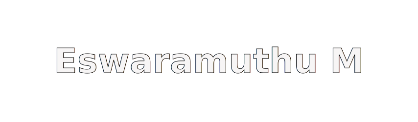

<a name="top"></a>
<div align="center">


[](https://git.io/typing-svg)


<p>
  <a href="https://portfolio-website-ochre-six-47.vercel.app/"></a>
  <a href="https://github.com/meswaramuthu"></a>
  <a href="https://www.linkedin.com/in/meswaramuthu/"></a>
  <a href="mailto:meswaramuthu28@gmail.com"></a>
  <br><br>
  <a href="https://leetcode.com/u/meswaramuthu/"></a>
  <a href="https://www.geeksforgeeks.org/profile/meswarajh9z"></a>
</p>

</div>

---

### Summary

```python
class AIEngineer:
    def __init__(self):
        self.name = "Eswaramuthu M"
        self.role = "Software Engineering Intern, Stratova.ai"
        self.education = "B.Tech CSE (AI/ML), SRM IST — Vadapalani | CGPA 9.51 | Class of 2027"

        self.experience = [
            {"role": "Software Engineering Intern", "org": "Stratova.ai", "status": "current"},
            {"role": "AI/ML Intern", "org": "ZeroEka (Nirmaan, IIT Madras)", "status": "past"},
        ]

        self.currently_building = [
            "JANY — production AI customer support agent",
            "AUGY — RAG pipeline (FAISS, ChromaDB, Gemini embeddings, LangGraph)",
        ]

        self.research = (
            "Hallucination-Aware RAG Pipeline with Self-Verification Loop "
            "— dual-LLM critic architecture, targeting IEEE/Scopus publication"
        )

        self.competitive_programming = {
            "platform": "LeetCode",
            "rank": "Knight",
            "rating": "~1906 (Top 4.3% globally)",
        }

        self.leadership = [
            "Joint Technical Head, Exadata Club, SRMIST",
            "Project Admin, GSSoC 2026 — AI Agents Track",
            "Microsoft Learn Student Ambassador (ID: 502099)",
        ]

    def focus_areas(self):
        return ["LLMs & Agentic AI", "RAG Systems", "Computer Vision", "Applied ML"]
```

---

# Technical Skills

<div align="center">

## Languages & Frontend

<p>
  
</p>


---

## Backend, Data & Cloud

<p>
  
</p>


---

## AI & ML Power

<p>
  
</p>


---

## Agentic AI & Retrieval


</div>

---

### Research

| Title | Status |
|---|---|
| **Hallucination-Aware RAG Pipeline with Self-Verification Loop** — dual-LLM architecture with critic-based verification | In preparation — IEEE/Scopus target |

---

### Projects

| Project | Description | Tech Stack |
|---|---|---|
| **[Achievement Management System](https://github.com/meswaramuthu/Achievement-Management-System)** | Full-stack platform —   | `React` `Node.js` `MongoDB` |
| **DemandIQ** | Hybrid LSTM + XGBoost + Random Forest demand forecasting engine | `Python` `TensorFlow` `XGBoost` |
| **CollisionGuard AI** | Real-time collision detection using YOLOv8 and MiDaS depth estimation | `Python` `YOLOv8` `OpenCV` |
| **SyllabiX** | Gemini API-powered personalized study plan generator | `Python` `Gemini API` `LangChain` |
| **AUGY** | RAG pipeline using FAISS, TF-IDF embeddings, ChromaDB, and LangGraph | `Python` `LangGraph` `ChromaDB` `FAISS` |
| **[Leetcode-Problems](https://github.com/meswaramuthu/Leetcode-Problems)** | Daily LeetCode solutions in Java covering core DSA concepts | `Java` `Data Structures` `Algorithms` |

---

### GitHub Activity

<p align="center">
  
  
</p>

<p align="center">
  
</p>

---

Open to AI/ML engineering and software development roles. Feel free to reach out via email or LinkedIn.

<div align="center">

<p align="center"><a href="#top"></a></p>

</div>


